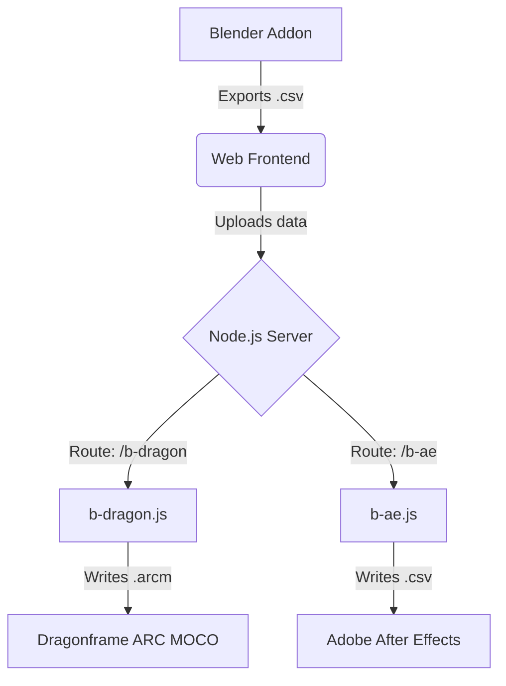

# Architecture: BlenderDragon

BlenderDragon is a bridge toolset designed to convert keyframe data from Blender into formats compatible with the Dragonframe Motion Control Module (ARC MOCO) and Adobe After Effects.

The project is structured into three main components: a **Blender Addon**, a **Node.js Express Server**, and a **Web Frontend**.

## System Overview

## 1. Blender Addon (`__init__.py`)
A Python script that integrates natively into Blender as an Import-Export addon.
- **Functionality**: Reads animation fcurve keyframe points (specifically location and rotation data representing `vTRACK`, `vTILT`, and `vPAN` movement axes) from the selected object.
- **Output**: Exports a raw `.csv` file containing the timeline array index and coordinate values.

## 2. Node.js Backend Server (`server.js`)
An Express.js web server that serves the frontend application and provides API routes for data processing and conversion.
- **`server.js`**: Initializes the Express app, serves static files from the `/public` directory, and defines backend routes mapped to processor modules.
- **Processors**:
  - **`js/b-dragon.js`**: Handles requests on the `/b-dragon` endpoint. Takes raw CSV data passed from the frontend, reorganizes it by axes (X Position for `vTRACK`, X Rotation for `vTILT`, Z Rotation for `vPAN`), and uses the `xmlbuilder2` package to generate a valid `.arcm` XML file. This file represents native Dragonframe ARC MOCO data.
  - **`js/b-ae.js`**: Handles requests on the `/b-ae` endpoint. Processes the CSV data and converts values from radians to degrees, outputting a frame-by-frame 3-column `.csv` file designed to be imported into Adobe After Effects.

## 3. Web Frontend (`public/`)
A responsive HTML/CSS/JS single-page application that provides visualization and acts as the user interface for file conversion.
- **`public/html/index.html`**: The main interface structure containing a drag-and-drop zone and output directory configuration.
- **`public/js/drag_and_drop.js`**: 
  - Handles the client-side drag-and-drop file API.
  - Uses the native `FileReader` API to read the CSV content locally.
  - **Data Visualization**: Extracts axis data locally and renders preview graphs for `vTRACK`, `vTILT`, and `vPAN` using **Chart.js**.
  - **Submission**: Intercepts form submission and uses `fetch()` to POST the parsed CSV data array to the configured conversion endpoint (`/b-dragon` or `/b-ae`).

## Data Flow Pipeline
1. The user animates an object (typically a camera) in **Blender**.
2. The user exports the animation as `.csv` using the **Dragon Moco Exporter** addon.
3. The user opens the local Web App (`http://localhost:3000`) and drags the `.csv` file into the UI.
4. The client-side JS renders a Chart.js visualization of the movement curves.
5. The user types an output directory path, selects their target software (ARCM or AE), and submits.
6. The JS Fetch API posts the raw data to the Node backend.
7. The appropriate Express router (`b-dragon.js` or `b-ae.js`) processes the string array, mathematically translates values (e.g., radians to degrees), builds the final file (XML or CSV), and writes it to the designated local file path using the `fs` module.